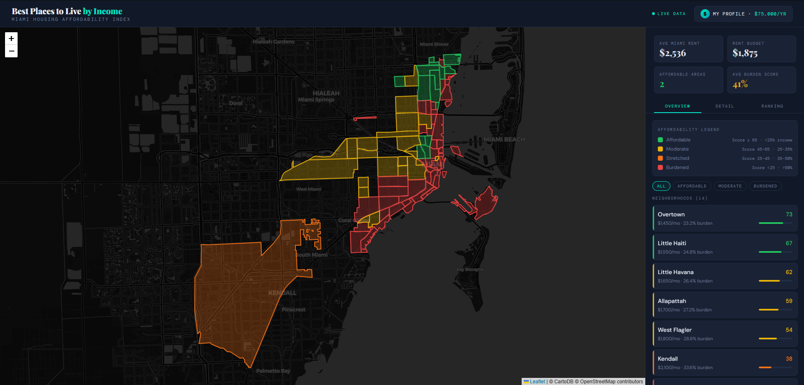

# Miami Housing Affordability Map

An interactive map that scores 14 Miami neighborhoods by rental affordability against your actual financial profile. Enter your income, debts, household size, and preferences — the map updates in real time.



## How it works

Each neighborhood gets a score from 0–100 based on how the adjusted rent compares to your effective monthly budget. The score accounts for:

- Salary, hourly, freelance, or fixed income
- Partner income and household size
- Monthly debts (car, student loans, credit cards)
- A savings target treated as a fixed monthly cost
- Budget rule: 30%, 28%, 35%, 40%, or DTI-based
- Lifestyle add-ons: parking (~$150/mo), pets (~$50/mo)
- Optional score boosts for good schools or work-from-home priority

The sidebar has three views: an **Overview** list with filter buttons, a **Detail** panel with rent breakdown and charts for a selected neighborhood, and a **Ranking** view comparing all 14 by adjusted rent.

## Running it

Requires [Node.js](https://nodejs.org).

```bash
npm install
npx vite
```

Open `http://localhost:5173`. To build for deployment:

```bash
npx vite build
```

Output goes to `dist/`.

## Project structure

```
├── index.html
├── package.json
├── vite.config.js
└── src/
    ├── main.js        entry point, App coordinator
    ├── style.css
    ├── data.js        neighborhood records
    ├── geodata.js     GIS boundary polygons
    ├── utils.js       formatting and color helpers
    ├── profile.js     financial state and budget calculations
    ├── map.js         Leaflet map and polygon rendering
    ├── drawer.js      profile panel
    ├── sidebar.js     tabs, filters, panel HTML
    └── charts.js      Chart.js builders
```

## Neighborhoods

| Neighborhood | Notes |
|---|---|
| Brickell | Financial district, highest rents |
| Downtown Miami | Best transit in the city |
| Edgewater | Bayfront, growing |
| Midtown Miami | Between Wynwood and Design District |
| Wynwood | Art district |
| Design District | Luxury retail corridor |
| Little Haiti | Most affordable in the urban core |
| Allapattah | Emerging, west of Wynwood |
| Overtown | Historic, central location |
| West Flagler | Working-class, family-oriented |
| Little Havana | Cultural hub, affordable |
| Coconut Grove | Upscale, marina access |
| Key Biscayne | Island, exclusive |
| Kendall | Large suburb, car-dependent |

## Updating the data

Rent, income, and livability figures are estimates based on 2024–2025 market data. To update them, edit the `NEIGHBORHOODS` array in `src/data.js`. Each record:

```js
{
  id: 'wynwood',
  name: 'Wynwood',
  lat: 25.8008, lng: -80.1994,
  medianRent: 2950, medianIncome: 58000,
  studio: 2100, oneBed: 2950, twoBed: 4100,
  population: 18200,
  walkScore: 88, transitScore: 62, bikeScore: 74,
  trend: [2400, 2550, 2680, 2800, 2900, 2950],
}
```

Live data sources: [RentCast](https://developers.rentcast.io) (rent), [Census ACS](https://api.census.gov) (median income), [Walk Score API](https://www.walkscore.com/professional/api.php) (livability scores).

Boundary polygons are in `src/geodata.js`. City of Miami shapefiles are available at [datahub-miamigis.opendata.arcgis.com](https://datahub-miamigis.opendata.arcgis.com).

## Stack

- [Leaflet](https://leafletjs.com) — map and polygon layers
- [Chart.js](https://www.chartjs.org) — rent trend and ranking charts
- [Vite](https://vitejs.dev) — dev server and bundler
- [CartoDB Dark Matter](https://carto.com/basemaps) — base tile layer

## License

MIT
